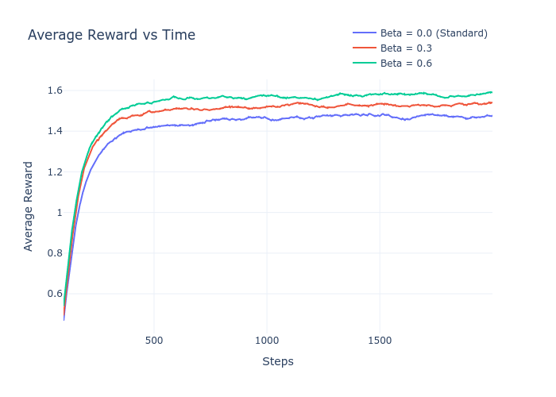
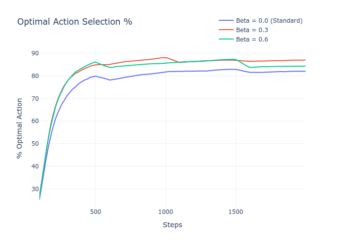
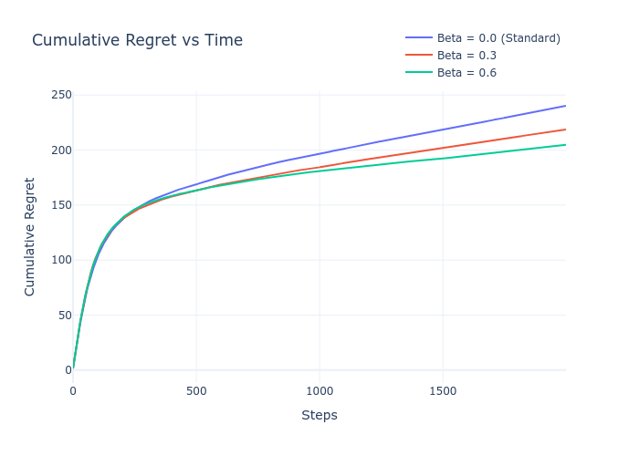

# Non-Stationary Gradient Bandit Analysis


> **An advanced Reinforcement Learning implementation demonstrating how adaptive baselines improve gradient bandit performance in non-stationary environments.**

## Table of Contents
- [Problem Statement](#problem-statement)
- [Solution Overview](#solution-overview)
- [Key Features](#key-features)
- [Installation](#installation)
- [Quick Start](#quick-start)
- [Results](#results)
- [Technical Architecture](#technical-architecture)

## Problem Statement

In standard Multi-Armed Bandit problems, the reward distribution for each arm is constant. However, in **non-stationary environments**, these distributions drift over time (e.g., via a Random Walk). Standard Gradient Bandit algorithms that use a simple average baseline fail to adapt quickly to these changes, leading to suboptimal long-term performance and high regret.

This project implements and analyzes an **Adaptive Gradient Bandit** that uses a variance-based window mechanism to track changing means more effectively than static baselines.

## Solution Overview

The core of this solution is the `AdaptiveGradientBandit` agent, which introduces a dynamic baseline calculation:

1.  **Variance-Based Weighting**: Instead of a simple moving average, the baseline computation weights recent rewards based on their variance.
2.  **Adaptive Baseline ($\beta$)**: A parameter $\beta$ controls the mix between the global average and the recent variance-adjusted mean.
    *   $\beta = 0$: Standard Gradient Bandit (Global Average).
    *   $\beta > 0$: Adaptive Gradient Bandit (Responsive to drift).
3.  **Softmax Exploration**: Action probabilities are updated using gradient ascent on the preference function $H_t(a)$.

## Key Features

*   **Non-Stationary Environment**: Simulates random walk drift for 10 arms.
*   **Adaptive Algorithms**: Configurable $\beta$ parameter to test sensitivity.
*   **Comprehensive Metrics**: Tracks Regret, Average Reward, % Optimal Action, and Baseline values.
*   **Automated Visualization**: Generates comparative plots using Plotly.

## Installation

### Prerequisites
*   Python 3.11

### Setup

**Option 1: Using Conda (Recommended)**
```bash
conda create -n gradient_bandit python=3.11
conda activate gradient_bandit
pip install -r requirements.txt
```

**Option 2: Using Standard Pip**
```bash
# Optional: Create a virtual environment
python -m venv venv
source venv/bin/activate  # On Windows: venv\Scripts\activate

pip install -r requirements.txt
```

## Quick Start

Run the main experiment script to execute the simulation across different $\beta$ values (0.0, 0.3, 0.6):

```bash
python assignment1.py
```

This will:
1.  Run 200 independent simulations for each configuration.
2.  Log progress to `outputs/<timestamp>/logs/experiment.log`.
3.  Save result plots to `outputs/<timestamp>/results/`.

## Results

The following plots demonstrate the superior performance of the adaptive baseline ($\beta > 0$) compared to the standard approach.

### Average Reward vs Time
The adaptive agent (Red/Green) recovers faster from distribution drifts than the standard agent (Blue).



### % Optimal Action
The adaptive agent maintains a higher probability of selecting the optimal arm as the environment changes.



### Cumulative Regret
Lower regret indicates better long-term performance in tracking the optimal arm.



## Technical Architecture

The interaction between the Agent and the Non-Stationary Environment is modeled as follows:

```text
        +-----------------------------------+
        |            Environment            |
        |   (Non-Stationary, Random Walk)   |
        +----------------+------------------+
                         |
           ^             | Reward R
  Action A |             |
           |             v
        +----------------+------------------+
        |              Agent                |
        |    (Adaptive Gradient Bandit)     |
        |   Updates Preferences H(a)        |
        +-----------------------------------+
```
