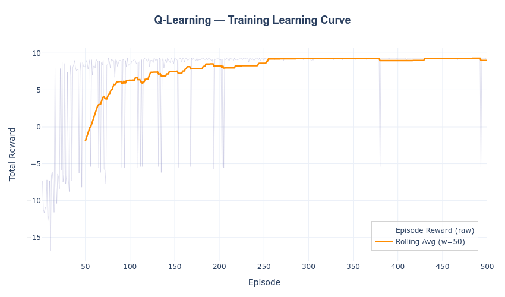
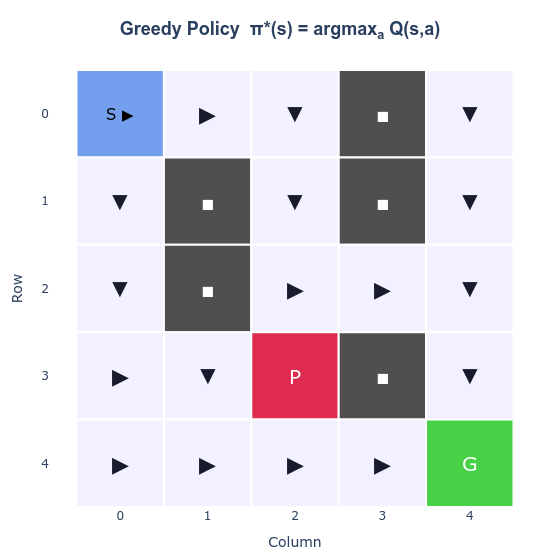
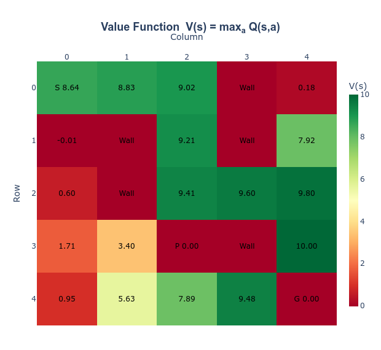

# E1-277 Reinforcement Learning — IISc


> **Two comprehensive Reinforcement Learning assignments focusing on Adaptive Gradient Bandits for non-stationary environments and Q-Learning on tabular GridWorlds.**

A collection of high-quality implementations for foundational RL algorithms designed for the E1-277 course at the Indian Institute of Science (IISc).

---

## Table of Contents

- [Quick Start](#quick-start)
- [Problem Statement & Solutions](#problem-statement--solutions)
- [Technical Architecture & Environment](#technical-architecture--environment)
- [Performance & Visualizations](#performance--visualizations)
- [Installation & Setup](#installation--setup)
- [Repository Structure](#repository-structure)

---

## Quick Start

The fastest way to see the reinforcement learning agents in action:

```bash
# Clone the repository
git clone <repo-url>
cd E1-277-Reinforcement-Learning-IISc

# Create and activate the conda environment
conda create -n RL python=3.11 -y
conda activate RL

# Install dependencies
pip install -r requirements.txt

# Run Assignment 1 (Adaptive Gradient Bandit)
python src/assignment1.py

# Run Assignment 2 (Q-Learning on GridWorld)
python src/assignment2.py
```

Outputs, including plots and logs, will be automatically generated in timestamped directories within the `outputs/` folder.

---

## Problem Statement & Solutions

### Assignment 1 — Adaptive Gradient Bandit
In standard Multi-Armed Bandit problems, reward distributions are stationary. However, in **non-stationary environments**, distributions drift over time. Standard Gradient Bandit algorithms fail to adapt quickly. 

**Solution**: The `AdaptiveGradientBandit` introduces:
- **Variance-Based Weighting**: Weights recent rewards inversely proportional to their variance.
- **Adaptive Baseline (β)**: Dynamically balances between a global average and a variance-adjusted recent mean.

### Assignment 2 — Q-Learning on GridWorld
An implementation of **Q-Learning** (off-policy temporal-difference control) on a 5×5 tabular GridWorld. The agent learns to navigate from a start cell to a goal cell, avoiding obstacles and pits, entirely through trial-and-error experience.

**Solution**:
- Implements an $\epsilon$-greedy exploration strategy with exponential decay.
- Uses Off-Policy Temporal Difference learning to approximate the optimal action-value function $Q^*(s, a)$.

---

## Technical Architecture & Environment

### GridWorld Layout (Assignment 2)
A 5×5 deterministic GridWorld environment:

```text
 S  .  .  W  .
 .  W  .  W  .
 .  W  .  .  .
 .  .  P  W  .
 .  .  .  .  G
```

| Symbol | Description | Reward | Terminal |
|--------|-------------|--------|----------|
| `S`    | Start       | -0.1   | No       |
| `.`    | Empty       | -0.1   | No       |
| `G`    | Goal        | +10.0  | Yes      |
| `P`    | Pit         | -5.0   | Yes      |
| `W`    | Wall        | N/A    | No       |

### Q-Learning Update Rule
```math
Q(s, a) \leftarrow Q(s, a) + \alpha \left[ r + \gamma \max_{a'} Q(s', a') - Q(s, a) \right]
```

---

## Performance & Visualizations

### Assignment 1: Adaptive vs Standard Baseline
The adaptive baseline allows the agent to recover significantly faster from reward distribution drifts, leading to higher optimal action selection and lower regret.

| Metric | Visualization |
|--------|---------------|
| **Rewards** |  |
| **Optimal Actions** |  |
| **Regret** |  |

### Assignment 2: Q-Learning Navigation
The agent effectively converges to the optimal path, avoiding the pit and minimizing steps.

| Metric | Visualization |
|--------|---------------|
| **Learning Curve** |  |
| **Greedy Policy** |  |
| **Value Function** |  |

---

## Installation & Setup

### Prerequisites
- Python 3.11
- Conda (highly recommended for environment management)

### Environment Setup
```bash
conda activate RL
pip install -r requirements.txt
```

### Dependencies
- `numpy>=1.20.0`
- `plotly>=5.0.0`
- `kaleido==0.2.1`
- `scipy>=1.7.0`

---

## Repository Structure

```text
E1-277-Reinforcement-Learning-IISc/
├── src/
│   ├── assignment1.py          # Adaptive Gradient Bandit implementation
│   └── assignment2.py          # Q-Learning on GridWorld implementation
├── assignments/
│   ├── RL-Assignment-1.pdf     # Assignment 1 instructions
│   └── RL_Assignment_2.pdf     # Assignment 2 instructions
├── outputs/                    # Timestamped execution outputs
├── assets/                     # README visualization images
├── requirements.txt            # Python dependencies
└── README.md                   # Project documentation
```
